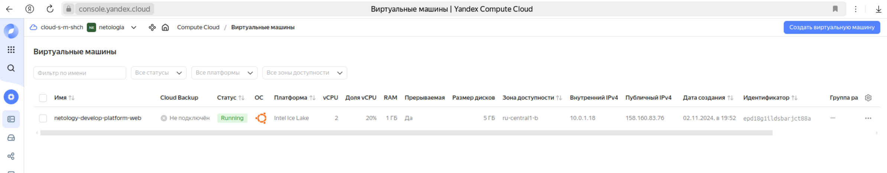
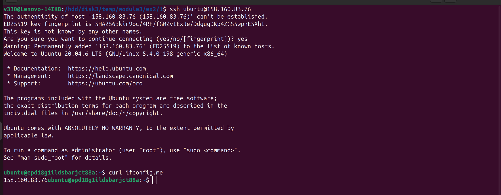
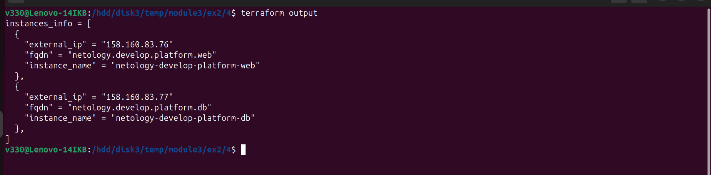
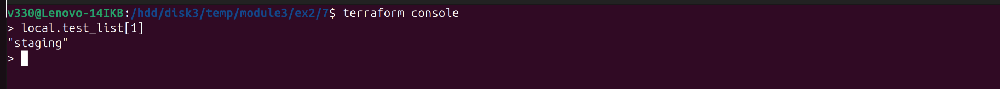
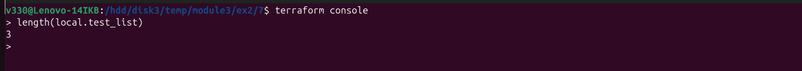
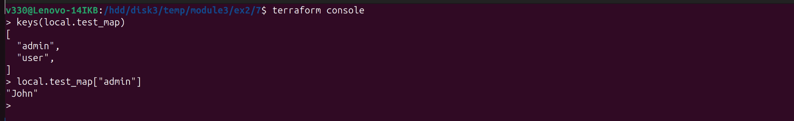
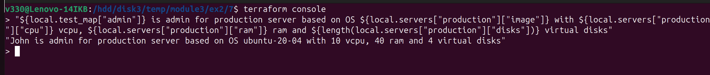
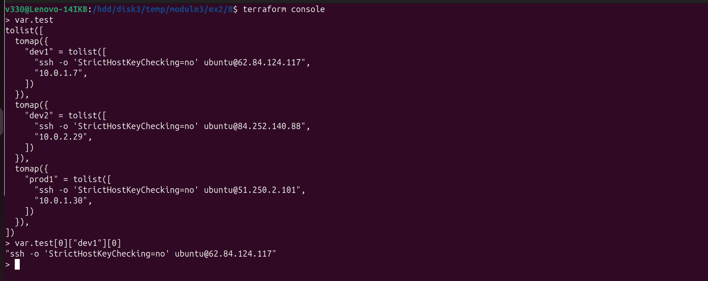
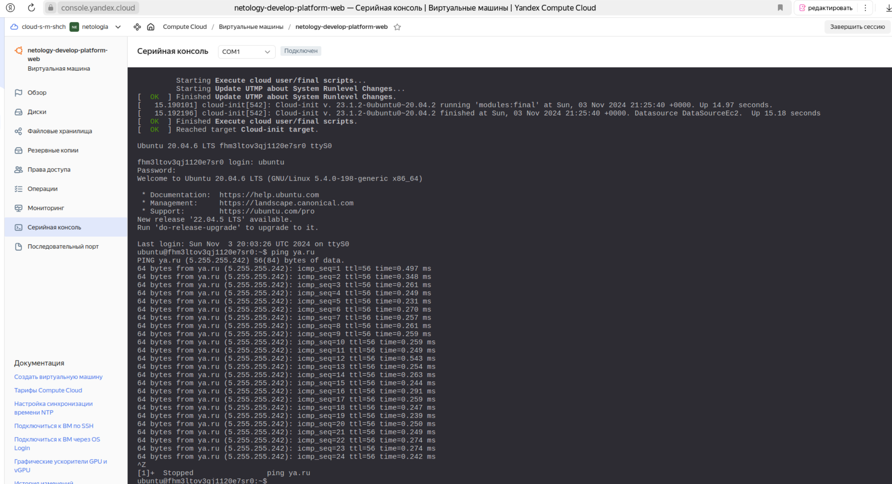

### Домашнее задание к занятию «Основы Terraform. Yandex Cloud»

### Задача 1  
4.  
Скриншот ЛК Yandex Cloud с созданной ВМ, где видно внешний ip-адрес  
  

4.1.  
  > Error: Invalid function argument
  > on providers.tf line 15, in provider "yandex":
  > 15:   service_account_key_file = file("~/.authorized_key.json")
  
Ответ:  
Прописать правильный путь расположения файла key.json с авторизованным ключем в "providers.tf"

4.2.  
  > Error: Error getting zone while creating instance: cannot determine zone: please set 'zone' key in this resource or at provider level
  > 
  >  with yandex_compute_instance.platform,
  >  on main.tf line 15, in resource "yandex_compute_instance" "platform":
  >  15: resource "yandex_compute_instance" "platform" {

Ответ:  
В файле "main.tf" нужно указать 'zone' для resource "yandex_compute_instance" "platform"
   zone = var.default_zone

4.3.  
  > Error: Error while requesting API to create instance: server-request-id = 977f3a20-8cba-45db-aa73-0b21c9a8d2ea server-trace-id =   > 6202ad1949a277c1:cd23bee50c70ea28:6202ad1949a277c1:1 client-request-id = 84c11257-acb0-4aa7-81c4-fe3aa3b2f003 client-trace-id = a219bef6-028b-4e0c-b816-73828b045169 rpc error: code = FailedPrecondition desc = Platform "standart-v4" not found
  > 
  >  with yandex_compute_instance.platform,
  >   on main.tf line 15, in resource "yandex_compute_instance" "platform":
  >   15: resource "yandex_compute_instance" "platform" {

Ответ:  
Неправильный идентификатор платформы для resource "yandex_compute_instance" "platform"
ссылка на источник: [https://yandex.cloud/en/docs/compute/concepts/vm-platforms](https://yandex.cloud/en/docs/compute/concepts/vm-platforms)   
  platform_id = "standard-v3"

4.4.  
  > Error: Error while requesting API to create instance: server-request-id = 97a5b7b5-859a-4494-ba51-d5b9f6166d07 server-trace-id =   > d26c6754f6cd3021:910909cfe8a764b6:d26c6754f6cd3021:1 client-request-id = 7747d459-8a38-4136-bf03-60336058c6b7 client-trace-id =   > fe820e36-8c47-4ed2-91dd-c310315f2191 rpc error: code = InvalidArgument desc = the specified core fraction is not available on platform "standard-v3"; allowed core fractions: 20, 50, 100
  >  
  >  with yandex_compute_instance.platform,
  >  on main.tf line 15, in resource "yandex_compute_instance" "platform":
  >  15: resource "yandex_compute_instance" "platform" {

Ответ:  
Неправильное значение фракции ядра для resource "yandex_compute_instance" "platform"
    core_fraction = 20

4.5.  
5)
  > Error: Error while requesting API to create instance: server-request-id = daf09046-5b9c-474c-a81e-3c1ef7fcb2eb server-trace-id = 404e96bd67081154:97ad46e02cd8f36b:404e96bd67081154:1 client-request-id = 31ac8a87-388e-42ce-b0e4-154bfdb694b7 client-trace-id = 717e8c82-0d88-4e0e-bc16-2992ee4d97e6 rpc error: code = InvalidArgument desc = the specified number of cores is not available on platform "standard-v3"; allowed core number: 2, 4
  > 
  >  with yandex_compute_instance.platform,
  >  on main.tf line 15, in resource "yandex_compute_instance" "platform":
  >  15: resource "yandex_compute_instance" "platform" {

Ответ:  
Неправильное значение числа ядер для resource "yandex_compute_instance" "platform"
    cores = 2

5.  
Скриншот консоли, curl отобразил тот же внешний ip-адрес;
  

6.  
Параметр "preemptible" показывает что экземпляр является прерываемым, таким образом это временная ВМ, которая будет остановлена яндекс-облаком автоматически ( по опыту из первых заданий, примерно через сутки), также преимуществом является более низкая цена по сравнению с непрерываемыми экземплярами

Параметр "core_fraction" определяет долю виртуальных процессорных ядер vCPU. Значение 5 означает что будет выделено 5% одного ядра.
Этот параметр также экономит ресурсы и затраты.

Файлы и скриншоты по задаче можно посмотреть [здесь](1/)  

***
### Задача 2  
Файлы и скриншоты по задаче можно посмотреть [здесь](2/)  

***
### Задача 3  
Файлы и скриншоты по задаче можно посмотреть [здесь](3/)  

***
### Задача 4  
2. 
Вывод значений ip-адресов 
  

Файлы и скриншоты по задаче можно посмотреть [здесь](4/)  

***
### Задача 5  
Файлы и скриншоты по задаче можно посмотреть [здесь](5/)  

***
### Задача 6  
Файлы и скриншоты по задаче можно посмотреть [здесь](6/)  

***
### Задача 7  
1.  
Скриншот второй элемент списка test_list  
  

2.  
Скриншот длина списка test_list  
  

3.  
Скриншот значение ключа admin из map test_map  
  

4.  
Скриншот interpolation-выражение  
  

Файлы и скриншоты по задаче можно посмотреть [здесь](7/)  

***
### Задача 8  
2.  
Скриншот длина списка test_list  
  

Файлы и скриншоты по задаче можно посмотреть [здесь](8/)  

***
### Задача 9  
Скриншот выхода в интернет при  отсутствии публичного ip-фдреса  
  

Файлы и скриншоты по задаче можно посмотреть [здесь](9/)  

Файлы финального проекта можно посмотреть [здесь](src/)  

